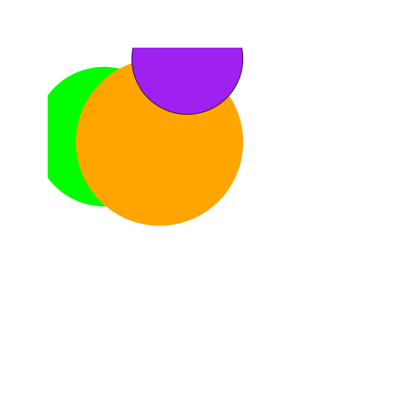
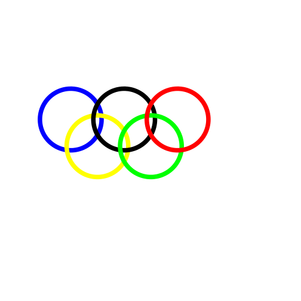

Day 04
========================================

# countodds & counteven

```r
countodds <- function(x) {
    k <- 0
    for (n in x) {
        if (n%%2 == 1) 
            k <- k + 1
    }
    return(k)
}

countodds(1:11)
```

```
## [1] 6
```

```r

counteven <- function(x) {
    k <- 0
    for (n in x) {
        if ((n + 1)%%2 == 1) 
            k <- k + 1
    }
    return(k)
}
counteven(1:8)
```

```
## [1] 4
```


# Triangles


```r
hypotenuseLength <- function(a, b) {
    c = sqrt((a^2) + (b^2))
    return(c)
}

hypotenuseLength(2, 5)
```

```
## [1] 5.385
```

```r

lawOfCosines <- function(a, b, q) {
    c = sqrt((a^2) + (b^2) - (2 * a * b * cos(q)))
    return(c)
}

lawOfCosines(10, 12, 3.14)
```

```
## [1] 22
```

```r

thetaFromLengths <- function(a, b, c) {
    d = acos(sqrt((a^2) + (b^2) - (c^2))/(2 * a * b))
    return(d)
}

thetaFromLengths(3, 4, 5)
```

```
## [1] 1.571
```


# Graphics


```r

background <- function(min = 0, max = 100) {
    plot(0, ylim = c(0, 100), xlim = c(0, 100), type = "n", xaxt = "n", yaxt = "n", 
        xlab = "", ylab = "", bty = "n", asp = 1)
}

circle <- function(x, y, r, ...) {
    angs <- seq(0, 2 * pi, length = 100)
    xpts <- x + r * cos(angs)
    ypts <- y + r * sin(angs)
    polygon(xpts, ypts, ...)
}

"overlapping circles"
```

```
## [1] "overlapping circles"
```

```r

background(0, 100)
circle(10, 72, 25, col = "green", border = "green")
circle(30, 70, 30, col = "orange", border = "orange")
circle(40, 100, 20, col = "purple")
```

 

```r

"olympic circles"
```

```
## [1] "olympic circles"
```

```r

background(0, 100)

circle(7, 63, 15, col = "transparent", border = "blue", lwd = 10)
circle(20, 50, 15, col = "transparent", border = "yellow", lwd = 10)
circle(33, 63, 15, col = "transparent", border = "black", lwd = 10)
circle(46, 50, 15, col = "transparent", border = "green", lwd = 10)
circle(59, 63, 15, col = "transparent", border = "red", lwd = 10)
```

 

